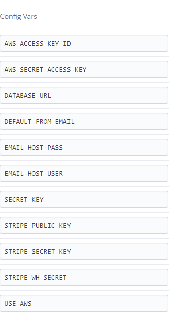

# [Kuzco Watches](https://kuzco-watches.herokuapp.com/)
<a name="totop"/>

## 

---

 >

- Link to live website [Kuzco Watches](https://kuzco-watches.herokuapp.com/)
---
Kuzco Watches is a final project with the [Code Institute](https://codeinstitute.net/ie/).
Project purpose:
In this project, I built a full-stack site based around business logic used to control a centrally-owned dataset. An authentication mechanism has been set and provides paid access to the site's data and/or other activities based on the dataset, such as the purchase of a product.

##### Table of Contents  
- [UX](#ux)  
- [The Site owner Goals](#usergoals)  
- [Existing Features](#existing)
- [Features Left to Implement](#leftfeatures)
- [Database Design](#dbdesign)
- [Project Requirements](#prequrements)
- [Wireframes](#wireframe)
- [Testing](#testing)
- [Deployment](#deployment)
- [Credits](#credits)
- [Acknowledgments](#ack)

## UX
<a name="ux"/>

### User Stories

- User 1 : As a user I want to view all available watches and their ratings and prices.
- User 2 : As a user I want to search for specific watches using type, description or     
other keywords.
- User 3 : As a user I want to view individually each watch's details and description.
- User 4 : When purchasing, I want to know the price I spent while browsing the site.
- User 5 : As a regular user I want to be able to register easily. 
- User 6 : As a returning user I want to be able to login to my account. 
- User 7 : I want to be notified by email when registered.
- User 8 : I want to have my own profile on the website.
- User 9 : I want to make a secure payment.
- User 10 : I want to save and update my payment details.
- User 11 : I want to be able to leave a review of the watch I purchased.
- User 12 : I want to be able to update or remove items from my shopping cart.
- User 13 : I want to receive an email confirmation about my purchase.

### The Site owner Goals
<a name="usergoals"/>

- Owner 1 : As a site owner I want to I want to have admin rights.
- Owner 2: As a site owner I want to be able to add and remove products.
- Owner 3 : As a site owner I want to be able to update products.

## Existing features
<a name="existing"/>

### Registered users

- Registered users have access to most of the features apart from the admin's page.

- Landing page;

    * Search bar;
        * Info delivery banner;
        * Search button;
        * My Profile;
            * Profile;
            * Reviews;
            * Logout;
        * Shopping Cart;
        - Login page
- Register page
- Error 404 page
    * Will appear in case of when the server can't find the requested resource.
- Error 4043 page
    * Will appear in case of Forbidden response status.
- Error 500 page
    * Will appear in case if the server encountered an unexpected condition.

    * Sorting;
        * All Watches;
        * For Him;
        * For Her;
        * Gifts & Deals;

     
- All Watches Page
    * Search bar;
    * Shopping Cart;
    * Cards with images, prices and ratings of the watches;       
    * Paginator;       
    * Footer;

- Watch Details Page
    * Search bar;
    * Shopping Cart;
    * Card with image, price and rating of the watch;       
    * Add to cart button;       
    * Continue Exploring button;       
    * Submit Review button;       
    * Paginator;       
    * Footer;

- Shopping Cart Page
    * Search bar;
    * Item image;
    * Item name;
    * Item SKU number;
    * Item price;
    * Item quantity;
         * Ability to update quantity;
         * Ability to remove item;
    * Subtotal including delivery charges;
    * Checkout button;
    * Continue to Explore button;
- Checkout Page
    * Search bar;
    * Form for personal details;
    * Card input;
    * Image and description of the item(s);
- Review Page
    * Search bar;
    * Form to submit reviews;
    * List of all reviews;
    * Abilty to remove/update your own reviews;

   
- Admin page
    * Restricted to admin only.

## Admin
- Admin page consists of the product abn categories sections. Admin has a right to edit and/or remove products,categories,users and reviews.
    * Ability to remove and update existing categories.
    * Ability to remove and update existing Products.
    * Ability to remove and update existing Reviews.
    * Ability to verify emails.

## Color scheme
Carefully selected color scheme with the idea in mind to create harmonious and aesthetically pleasing website where users would want to remain longer.
Main colour is #b7a90c which has a touch of golden shades and the black colour which blends together and leaves an expression of elecancy.

- Typography
     

## Features Left to Implement
<a name="leftfeatures"/>

- Implementing a modal popup window for confirmation before deleting items and logging out.Unable to complete due to a close deadline.
- Implementing Google,Facebook or possibly more applications OAuth.
- Adding Contact us page and more content.Unable to complete due to a close deadline.

## Database Design
<a name="dbdesign"/>

### Database Schema

## Project Requirements
<a name="prequrements"/>

Build a Django project backend by a relational database to create a website that allows users to store and manipulate data records about a particular domain.
Relational database (MySQL or Postgres),Stripe payments.

### Main Technologies:

HTML, CSS, JavaScript/jQuery, Python+Django

## Frameworks and libraries:
<a name="flibs"/>

- [**Django**](https://www.djangoproject.com/) full stack frameworks used for most of the website functionalities.
- [**jQuery**](https://jquery.com/) used as a JavaScript library and for Materialize components  initialization.
- [**Bootsrap4**](https://getbootstrap.com/) used as a front-end framework.

## Other Technologies used:
- [**Stripe**](https://stripe.com/) Used for implementing payment option
- [**SQLite3**](https://www.heroku.com/) Django's default database.
- [**heroku-postgresql**](https://www.heroku.com/) Heroku's database.
- [**Heroku**](https://www.heroku.com/)  used for hosting deployed website.
- [**AWS S3**](https://aws.amazon.com/s3/?nc2=type_a) used as a storage for static files.
- [**Google Dev Tools**](https://developer.chrome.com/docs/devtools/) used for developing and testing webpage.
- [**Firefox Dev Tools**](https://developer.mozilla.org/en-US/docs/Tools) used for developing and testing webpage.
- [**Balsamiq**](https://balsamiq.com) used for creating a wireframe.
- [**Resize Pixel**](https://www.resizepixel.com/) Free online image editor used to resize images format.
- [**Google Fonts**](https://fonts.google.com) used for project fonts.
- [**Font Awesome**](https://fontawesome.com/v5.15/icons?d=gallery&p=2) used for project icons.
- [**Ignore X-Frame headers**](https://chrome.google.com/webstore/detail/ignore-x-frame-headers/gleekbfjekiniecknbkamfmkohkpodhe/related) used to make override Django's Clickjacking Protection.

- [**Gitpod**](https://gitpod.io) used as a development environment.
- [**Gitpod Chrome Extension**](https://chrome.google.com/webstore/detail/gitpod-dev-environments-i/dodmmooeoklaejobgleioelladacbeki) used to open Github repo in Gitpod.
- [**GitHub**](https://github.com/) used for storing repository. 
- [**Canva**](https://www.canva.com) used for logo creation.
- [**Autoprefixer**](https://autoprefixer.github.io/) used to add CSS prefixes and ensure cross-browser compatibility.
- [**Youtube**](https://www.youtube.com/) used as a general source of information.
- [**W3School**](https://www.w3schools.com/) used as a general source of information.
- [**Pexel**](https://www.pexels.com/) used to download the website's images.
- [**Pixabay**](https://pixabay.com/) used to download the website's images.
- [**Stackoverflow**](https://stackoverflow.com/) used as a general source of information.
- [**W3C Markup Validator**](https://validator.w3.org/) Used to test HTML code validation.
- [**W3C CSS Validator - Jigsaw**](https://jigsaw.w3.org/css-validator/) Used to test CSS code validation.
- [**PEP8 online**](http://pep8online.com/) used during post deployment testing stage to ensure PEP8 requirement.
- [**Am I Responsive**](http://ami.responsivedesign.is/) used during post deployment testing stage.
- [**Pixlr**](https://pixlr.com) used to remove background and editing photographs.
- [**Ezgif**](https://ezgif.com/video-to-gif) used to covert videos to gif format.

<a name="wireframe"/>

To see Project Wireframes please click the link: 
<a href="https://github.com/kuzGo/kuzco/tree/main/Docs/wireframes">Wireframes</a>

## Testing :
<a name="testing"/>

- Testing file can be found here [TESTING.md](https://github.com/kuzGo/kuzco/blob/main/TESTING.md) 

## Deployment
<a name="deployment"/>

### Version control 

- The project's website code was written using Gitpod IDE. In order for code to be pushed to GitHub,it had to be added to stage for commit using `git add `command in GitPod's CLI .Once changes have been successfully added, it is required to commit these entering `git commit -m` into CLI. After committing it then can be pushed to GitHub by entering `git push` command in CLI.

### GitHub

- How to fork a repository: Forking a repository allows you to make changes to the code without affecting the project. To fork a repository follow the next steps:
1. If you do not have one,create a [GitHub](https://github.com/) account and remain logged in.
2. Navigate to [kuzGo/kuzco](https://github.com/kuzGo/kuzco);
3. In the top right corner find the "Fork" icon.
4. Click the Fork icon to fork the repository.

- How to clone repository: Cloning repository allows you to pull down a full copy of the repository and work on it locally on your machine. To clone a repository follow these steps:
1. If you do not have one,create a [GitHub](https://github.com/) account and remain logged in.
2. Navigate to [kuzGo/kuzco](https://github.com/kuzGo/kuzco);
3. On the repository main page navigate to the "Code" drop down menu button and click on it.
4. Ensure to select HTTPS and click on the clipboard icon to copy the URL.
5. In the IDE you chose to work, open the new terminal.
6. Change the current working directory location where you want the cloned directory.
7. Enter command git clone and paste the URL you copied.
8. Click Enter.

### Heroku

- The website is deployed to [Heroku](https://www.heroku.com/) due to GitHub's ability to only host static pages. To successfully  deploy the website to Heroku please follow these steps.

### Prerequisite
In order to successfully  run the app on Heroku,there are a few applications and dependencies required.
1. In the IDE terminal enter command `pip3 freeze--local > requirements.txt`.
2. Create Procfile using CLI command `echo web: python app.py > Procfile`. Delete a blank line to avoid any possible issues with the app.
- Heroku Deployment

1. If you do not have one,create a free [Heroku](https://www.heroku.com/) account and remain logged in.
2. For this particular project Python needs to be selected as a Primary Development Language.
3. Navigate to "Create New App" button.
4. Create a unique app name using hyphens instead of spaces.
5. Choose a region closest to you. I selected my region Europe.
6. Click Create App button.
7. Navigate tp Resorces tab and search and select Postgres database.Be sure to use Free plan.
8. In the Deploy section, as Deployment method select GitHub,this option will automatically deploy from GutHub repository.
9. In the Connect to GitHub section ensure that your GitHub profile is displayed.
10. Enter repository name and click Search button.
11. Once repository is found click Connect button.
12. Navigate to settings and click Reveal Config Vars.
13. Enter variables from `env.py` file :AWS_ACCESS_KEY_ID, AWS_SECRET_ACCESS_KEY,STRIPE_SECRET_KEY,STRIPE_WH_SECRET, SECRET_KEY. This is required step since Heroku will not be able to find these secured in `gitignore` folder.

14. Prior to enabling automatic deployment, make sure that requirements.txt and Procfile are pushed (`git push`)to GitHub.
15. Click Deploy Branch button.

## Credits :
<a name="credits"/>

### Code snippets :

For the purpose of this project I refered to and used authentication from the Code Institute Chris's [Boutique ADO](https://github.com/Code-Institute-Solutions/boutique_ado_v1).
The code snnipets used from this project have been refactored to make them my own and suit more my project's needs where it was possible.

[**Bootsrap4**](https://getbootstrap.com/) some components and some code snnipets have been used from Bootsrap.

### Photographers :

* Pexels:

 [Maciej PanFazi](https://www.pexels.com/video/watch-with-visible-parts-6867665/)

 [Antony Trivet](https://www.pexels.com/photo/gold-watch-from-above-9981574/)

 [Antony Trivet](https://www.pexels.com/photo/grand-carrera-brand-watch-with-strap-of-brown-crocodile-leather-9978676/)

 [Antony Trivet](https://www.pexels.com/photo/gold-watch-on-black-material-9982007/)

 [Antony Trivet](https://www.pexels.com/photo/gold-watch-on-black-material-9981575/)

 [Antony Trivet](https://www.pexels.com/photo/cartier-brand-watch-for-women-9978775/)

 [Antony Trivet](https://www.pexels.com/photo/watch-on-black-material-9981750/)

 [Antony Trivet](https://www.pexels.com/photo/gold-watch-from-above-9981574/)

 [Antony Trivet](https://www.pexels.com/photo/elegant-brown-watch-9980862/)

 [Pixabay](https://www.pexels.com/photo/analogue-blur-chrome-classic-280250/)

 [Pixabay](https://www.pexels.com/photo/luxury-clock-wrist-watch-gmt-master-47856/)
 
 [Alex Carollo](https://www.pexels.com/photo/black-citizen-analog-watch-592815/)
 
### Text Content:
Description of the watches have been taken mostly from established/official websites but these descriptions do not match real products.
It is used for purely educational purposes.

## Acknowledgements
<a name="ack"/>

- I wanted to thank [Nishant Kumar](https://github.com/nishant8BITS), for all the support and pieces of advice during mentoring sessions on how to improve the project.
- Code Institute for equipping me with the skills and knowledge to complete this project.
- Friends and family for support,motivation and creating activity datasets.
- Some parts of the README.md file have been used in my previous project.
- Slack comunity who helped me with fixing the bugs.
- Code Istitute Tutors : Jo,Sean,Igor,Shely and many others who helped me out of some hard times I had during my work on the project.

### Site is for educational purposes

[:arrow_up:](#totop)

