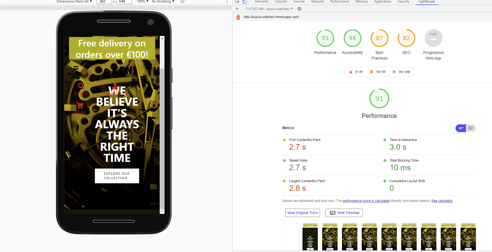
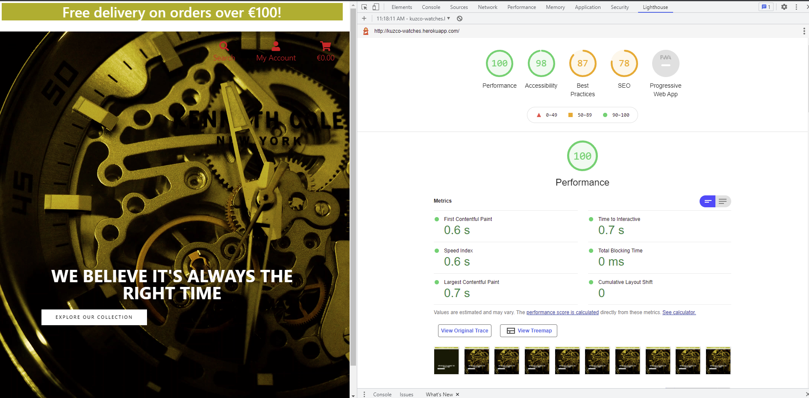

# Testing :
<a name="totop"/>

At various stages of the project development I have been using extensive testing of the website.Main tools used to test the website are Google Dev Tools,Firefox Dev Tools . To validate the code  I have been using W3C Markup Validator, W3C CSS Validator - PEP8 Online to ensure proper indentation and full PEP8 compliance. During development The [Built-In Django's Debugger](https://docs.djangoproject.com/en/4.0/ref/settings/) was set to `True` so the code has been refactored on multiple occasions should any errors occurred.

- Issue : One of the major issues occured after deploying my project, static files no longer work on localhost.
- Steps I took to resolve: I tried setting DEBUG=True, DEVELOPMNET= True, commented out postgres DB and and added : `STATIC_ROOT = os.path.join(BASE_DIR, 'static')`, ran ``collectstatic`` , however, css and JS are not working locally. 
  * Posted the issue on Slack channel #project-milestone-4 for assistance.
  * Contacted the Code Istitute Tutor support (Tutor Jo)
- Solution : Uncomment the database, revert evrything back to the original code and checked for typos in `DEVELOPMNET= True`

- Issue : During developing `update_reviews` in my ``Reviews`` class I have been constantly receiving an ``error 404``.
- Steps I took to resolve: Refactoring the code and tried to chnage the `` hovewer, after contacting Tutor support, with the assistance of Tutor Igor, we 
finally solved the issue.
- Solution : Moving the `` to the `reviews.html` and unindent the `return` code to render properly.

- Issue: During long hours of coding I ran into a bug while developing `checkout` models. 
- Steps I took to resolve: Refactoring the code. posted the issue #project-milestone-4 for assistance. Contacted the Code Istitute Tutor support (Tutor Sean)
- Solution:Sean spotted typo in `OrderLineItem` class and also the issue that I accidentally entered the code there insted in `Order` class. After refactoring the code the issue has been resolved.

 
 

## Code Validation

- Results of CSS code validation:
      - Code shows no errors.Note: Warnings are due to prefixes added using Autoprefixer to ensure cross-browser compatibility.

   <a href="Docs/W3C CSS Validator Kuzco.pdf" target="_blank" >Link to CSS Validation PDF Document</a>

   

    
   

       
  

   
   

- Results of HTML code validation:
      - Document checking completed. No errors to show, warnings are only for `type` unnesesary for javascript.

  <a href="Docs/Nu Html Checker Kuzco.pdf" target="_blank" >Link to HTML Validation PDF Document</a>

- Results of Python PEP8 code validation:

 
 

### Lighthouse reports of deployed website:

Lighthouse mobile report:

 
 

Lighthouse desktop report:

 
 

### User stories testing :

- User 1 :  As a user I want to view all available watches and their ratings and prices.

 

- User 2 : As a user I want to search for specific watches using type, description or     
other keywords.

 

- User 3 : As a user I want to view individually each watch's details and description.

 

- User 4 : When purchasing, I want to know the price I spent while browsing the site.

 

- User 5 : As a regular user I want to be able to register easily.

 

- User 6 : I want to be notified by email when registered.

 

- User 7 : I want to have my own profile on the website.

 

 

- User 8 : I want to make a secure payment.

 

- User 9 : I want to save and update my payment details.

 

- User 10 : I want to be able to leave a review of the watch I purchased.

 

- User 11 : I want to be able to update or remove items from my shopping cart.

 

 

- User 12 : I want to receive an email confirmation about my purchase.

 

   

#### Known Issues:

My main focus while working on this project was developing functionalities, this had an effect on the website's UI. Due to the close deadline I had to 
compromise some features. 

- Site footer currently has `position:relative` this makes it jump to the middle of the page if the page lacks the content, such as empty shopping cart.
- Shopping cart content is pushing the whole page to the left, this is to be further developed.
- Landing page lacks content, this is to be further developed.

[:arrow_up:](#totop)