# Testing :
<a name="totop"/>

At various stages of the project development I have been using extensive testing of the website.Main tools used to test the website are Google Dev Tools,Firefox Dev Tools . To validate the code  I have been using W3C Markup Validator, W3C CSS Validator - PEP8 Online to ensure proper indentation and full PEP8 compliance. During development The [Built-In Django's Debugger](https://docs.djangoproject.com/en/4.0/ref/settings/) was set to `True` so the code has been refactored on multiple occasions should any errors occurred.

- Issue : One of the major issues occured after deploying my project, static files no longer work on localhost.
- Steps I took to resolve: I tried setting DEBUG=True, DEVELOPMNET= True, commented out postgres DB and and added : `STATIC_ROOT = os.path.join(BASE_DIR, 'static')`, ran ``collectstatic`` , however, css and JS are not working locally. 
  * Posted the issue on Slack channel #project-milestone-4 for assistance.
  * Contacted the Code Istitute Tutor support (Tutor Jo)
- Solution : Uncomment the database, revert everything back to the original code and checked for typos in `DEVELOPMNET= True`

- Issue : During developing `update_reviews` in my ``Reviews`` class I have been constantly receiving an ``error 404``.
- Steps I took to resolve: Refactoring the code and tried to chnage the `` hovewer, after contacting Tutor support, with the assistance of Tutor Igor, we 
finally solved the issue.
- Solution : Moving the `` to the `reviews.html` and unindent the `return` code to render properly.

- Issue: During long hours of coding I ran into a bug while developing `checkout` models. 
- Steps I took to resolve: Refactoring the code. posted the issue #project-milestone-4 for assistance. Contacted the Code Istitute Tutor support (Tutor Sean)
- Solution:Sean spotted typo in `OrderLineItem` class and also the issue that I accidentally entered the code there insted in `Order` class. After refactoring the code the issue has been resolved.

## Code Validation

- Results of CSS code validation:
      - Code shows no errors.Note: Warnings are due to prefixes added using Autoprefixer to ensure cross-browser compatibility.

   <a href="Docs/W3C CSS Validator Kuzco.pdf" target="_blank" >Link to CSS Validation PDF Document</a>

   

    
   

       
  

   
   

- Results of HTML code validation:
      - Document checking completed. No errors to show, warnings are only for `type` unnesesary for javascript.

  <a href="Docs/Html_Checker.pdf" target="_blank" >Link to HTML Validation PDF Document</a>

- Results of Python PEP8 code validation can be found in Gihub repo forlder named "Docs".

- Please see below of the ``flake8`` warnings mainly in migrations files.

 
 
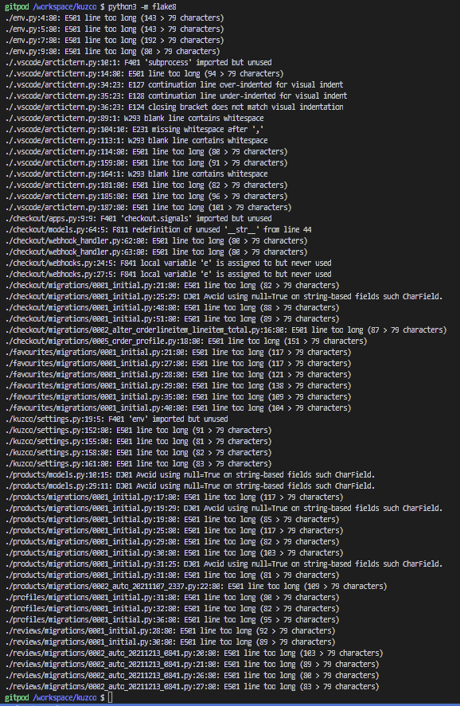

### Lighthouse reports of deployed website:

Lighthouse Desktop report:

 
 
<a href="Docs/lighthouseMS4.pdf" target="_blank" >Link to Desktop Lighthouse Report</a>

Lighthouse Mobile report:

 
 
<a href="Docs/lighhouse-mobile-ms4.pdf" target="_blank" >Link to Mobile Devices Lighthouse Report</a>

### User stories testing :

- User 1 :  As a user I want to view all available watches and their ratings and prices.

 

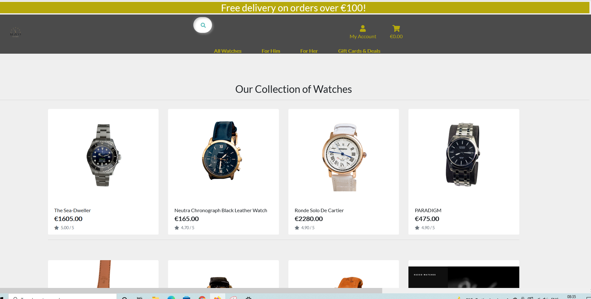

- User 2 : As a user I want to search for specific watches using type, description or     
other keywords.

 

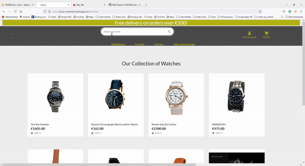

- User 3 : As a user I want to view individually each watch's details and description.

 

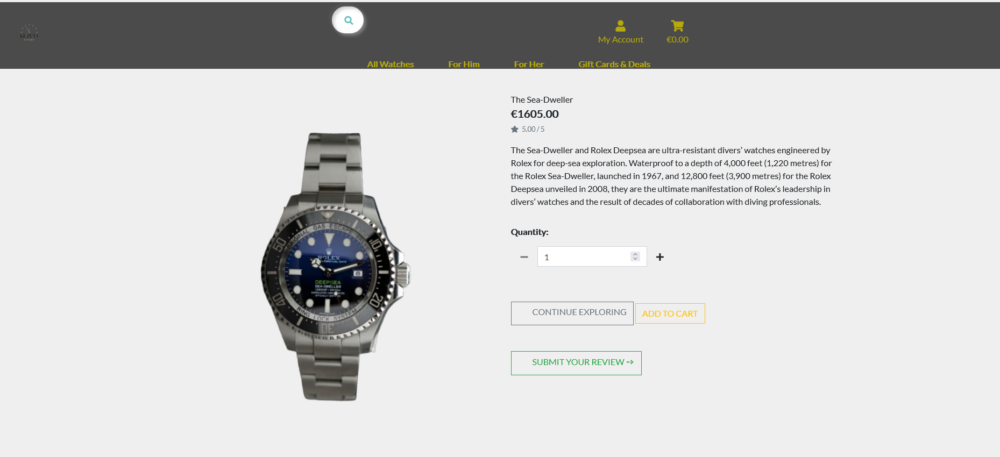

- User 4 : When purchasing, I want to know the price I spent while browsing the site.

 

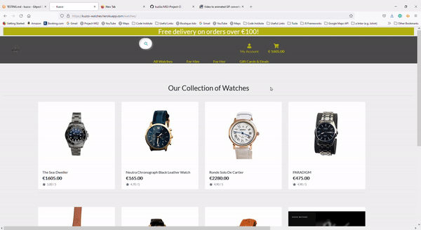

- User 5 : As a regular user I want to be able to register easily.

 

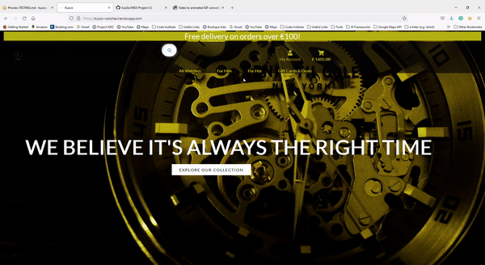

- User 6 : I want to be notified by email when registered.

 

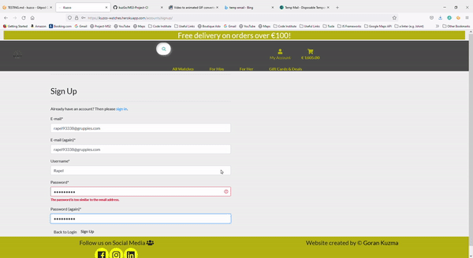

- User 7 : I want to have my own profile on the website.

 

 

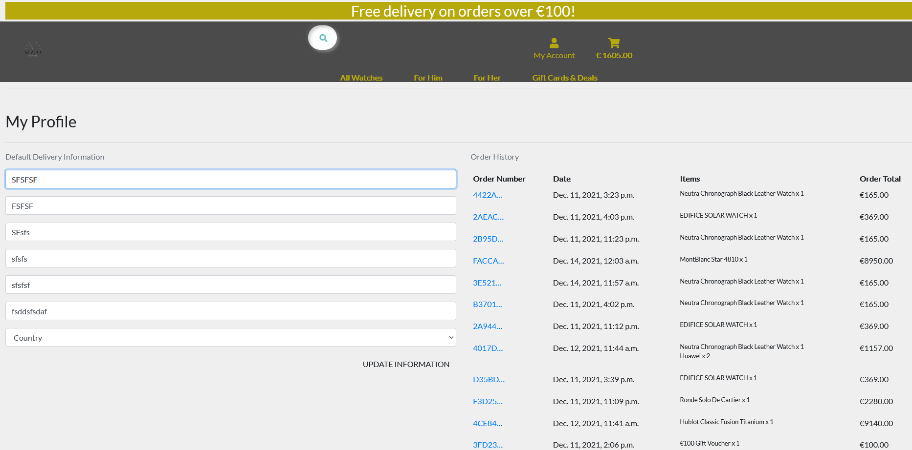

- User 8 : I want to make a secure payment.

 

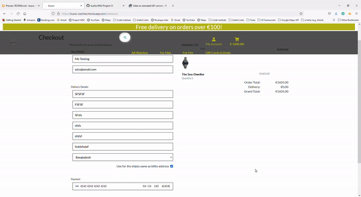

- User 9 : I want to save and update my payment details.

 

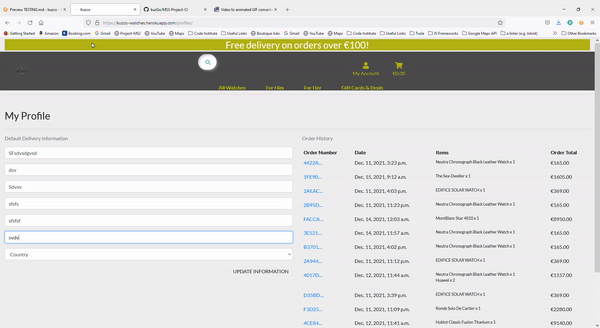

- User 10 : I want to be able to leave a review of the watch I purchased.

 

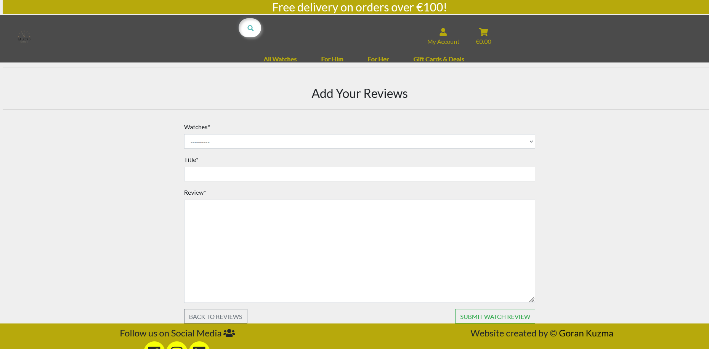

- User 11 : I want to be able to update or remove items from my shopping cart.

 

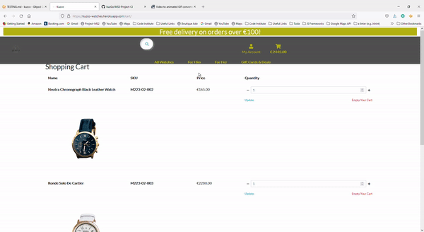

 

- User 12 : I want to receive an email confirmation about my purchase.

 

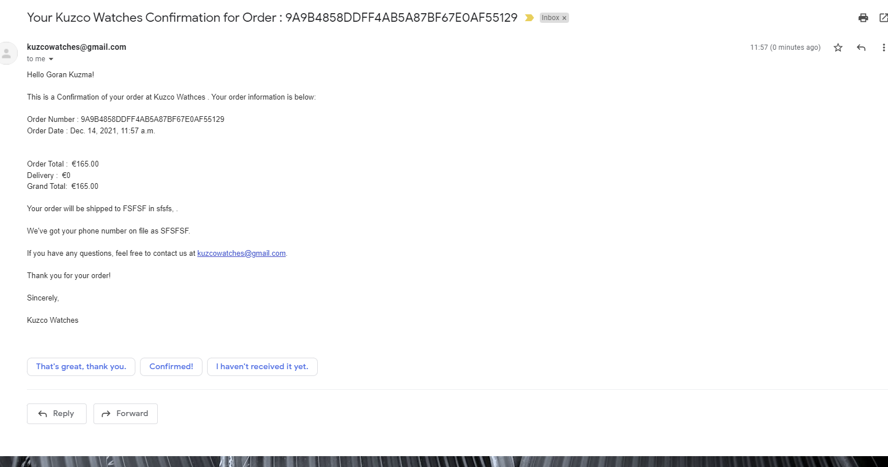

   

#### Functionality Testing:

As part of functionality testing the developer tested every part of the website to ensure that everything is working properly on different types of devices and screen sizes. Browsers that the website has been tested on are as follows:Google Chrome, Firefox, Microsoft Edge.Testing of the website was conducted on numerous devices that I and my close relatives and friends own,these are as follows : Samsung S21, Samsung S20,Samsung A52. Laptop Lenovo ThinkPad and Desktop screen sizes all report no issues.

#### Navigation bar:

##### Delivery Banner
1. Containing the Shop Now link, when hovered over letter spacing slighlty increases.
2. When clicked on the Shop Now link it it will bring the user to the all products page.

##### Search Bar

- The search bar is available on all pages and when hovered over, the seach bar extends slightly. If there is no searching criteria entered by the user,
 the user will be notified about the same and redirected to all watches page.  

 

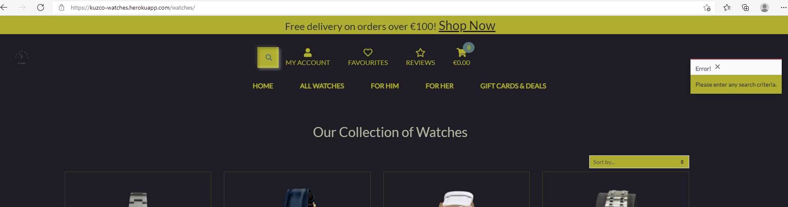

 

##### MY ACCOUNT

- MY ACCOUNT will change the text color to `#45777a` when hovered over. If the user is not logged in,when clicked it will only show two options:

   * Login:
    - Username or e-mail field
    - Pasword field
  * Sign Up:
    - E-mail field
    - E-mail field confirmation
    - Username
    - Password
    - Password Confirmation
    - Back To Login Button
    - Signup Button

    

     
    
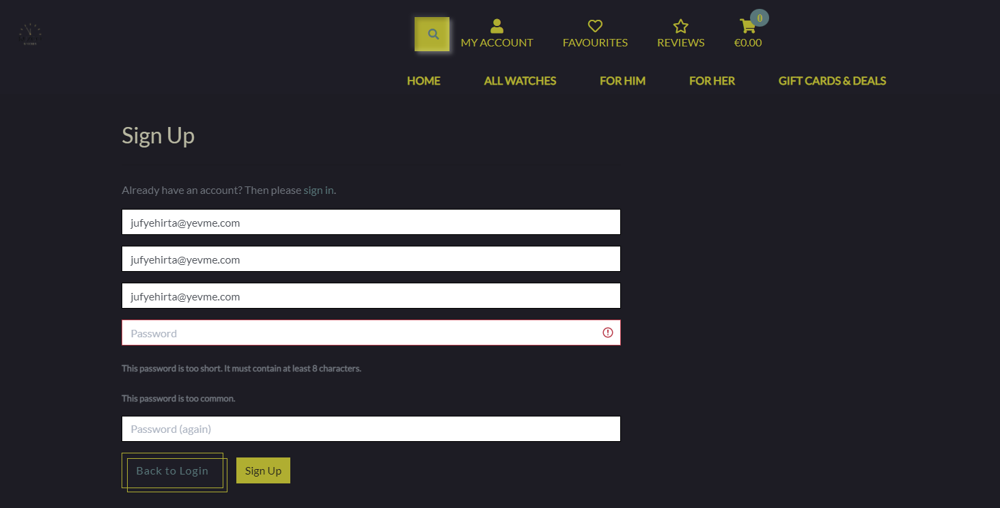

    
 

    

     
    
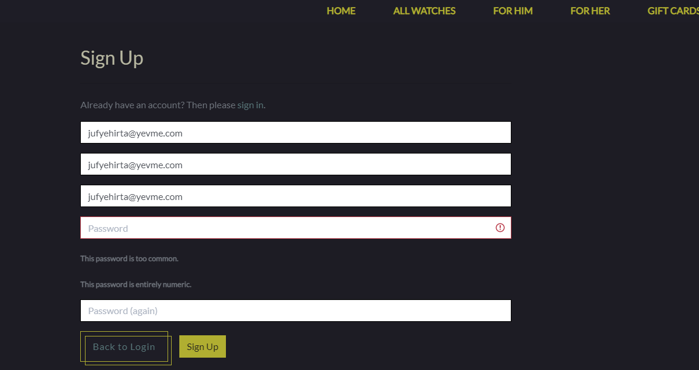

    
 

    

     
    
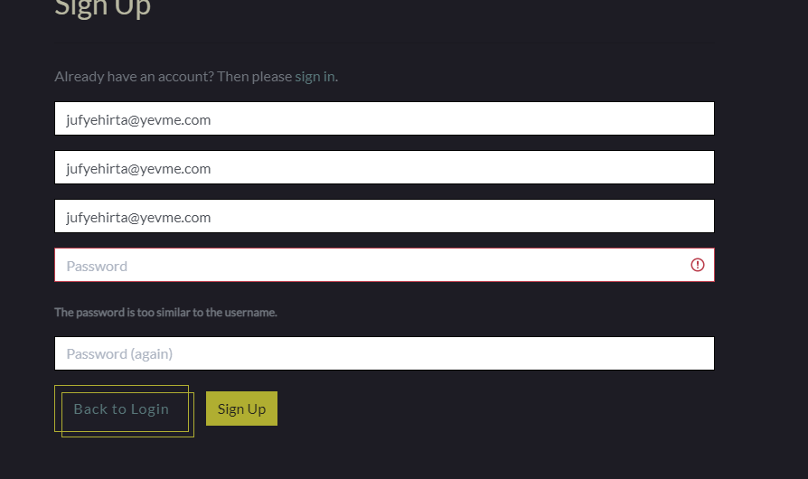

    
 

    

     
    
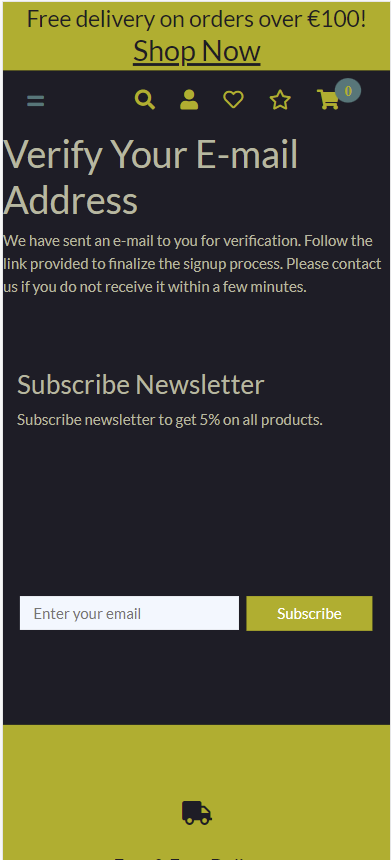

    
 

    

     
    
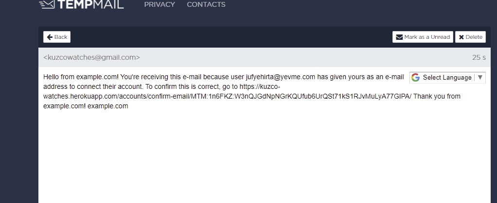

    
 

    

     
    
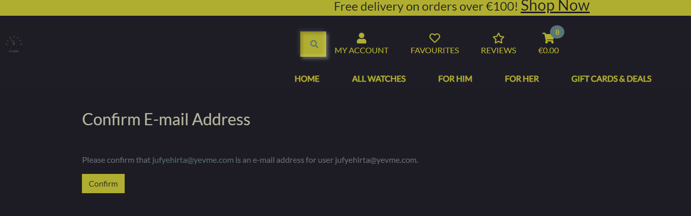

    
 

    

     
    
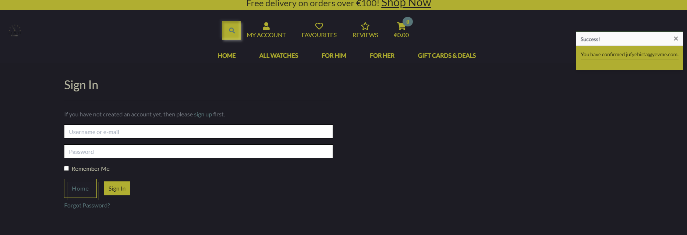

    
 

    

     
    
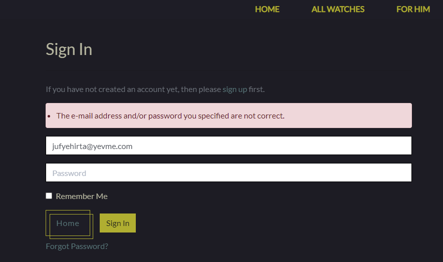

    
 

    

     
    
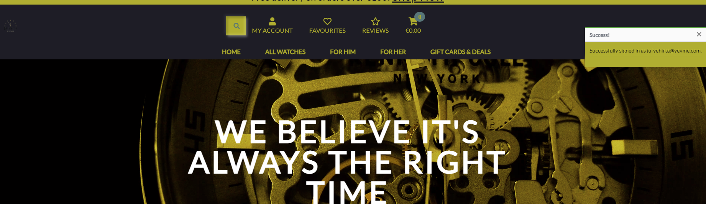

    
 
   

1. When the company logo is clicked it will bring the user to the home/landing page regardless of what page the user visits.
2. The Home button will change the text color to `#45777a` when hovered over. When clicked it will bring the user to the homepage.
3. ALL WATCHES button when clicked will present a nuber of options for the user to select and sort the items:
      * By Price
      * By SKU Number
      * By Rating
      * By Type
      * By With the Image
      * All Watches

4. FOR HIM button when clicked will present a nuber of options for the user to select and sort the items:
      * Chronograph
      * Sport
      * Smartwatch
      * All Watches

5. FOR HIM button when clicked will present a nuber of options for the user to select and sort the items:
      * Chronograph
      * Sport
      * Smartwatch
      * All Watches

6. FOR HIM button when clicked will present a nuber of options for the user to select and sort the items:
      * € 20
      * € 50
      * € 100
      * On Sale

[:arrow_up:](#totop)